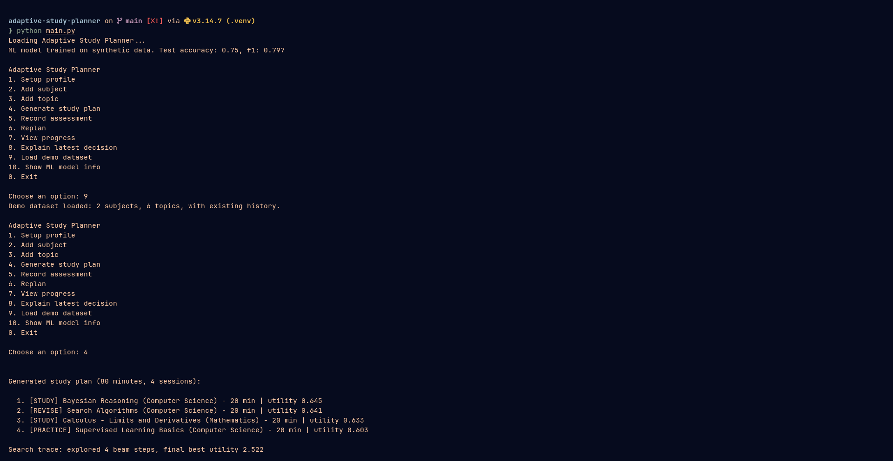
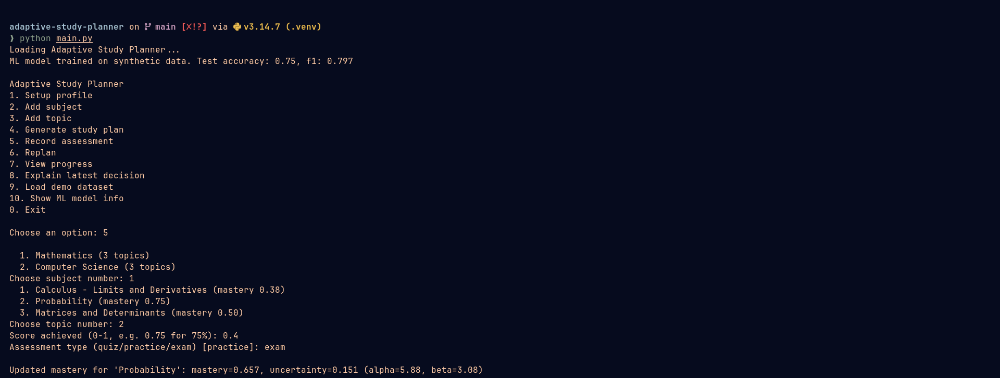
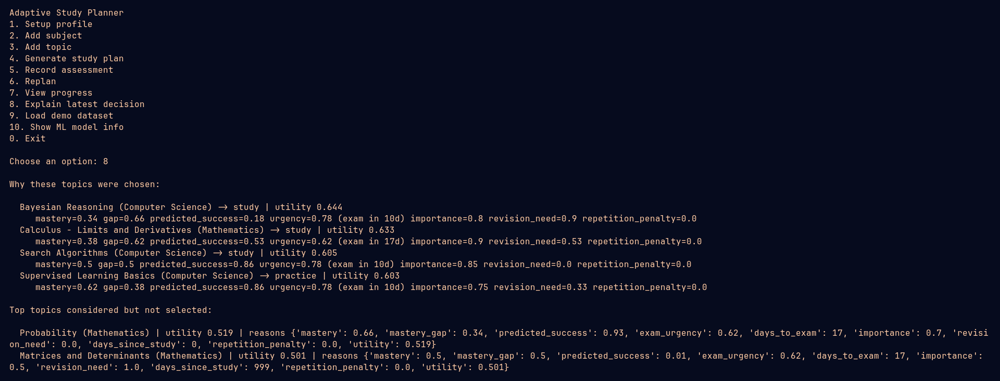

# Adaptive Study Planner Agent

A terminal based study planner built for the course **Fundamentals of Artificial Intelligence and
Machine Learning**. It keeps a Bayesian estimate of how well you know each topic, predicts your odds
of a successful study session with a small ML model, and uses an informed search algorithm to build
a daily plan under a time budget. Everything runs locally, no API key and no internet connection
needed at runtime.

## Overview

The planner treats studying as a sequential decision problem. Every topic has a mastery level and an
uncertainty around that level, tracked with a Beta distribution. A logistic regression model, trained
on a small bundled synthetic dataset, estimates how likely a study session on a given topic is to go
well, based on features like recent scores, difficulty and days since last review. A beam search
planner then searches over sequences of study/revise/practice actions and picks the combination that
maximizes a transparent utility function, while staying inside the student's available daily minutes.

After the student records a new assessment result, the mastery estimate updates and the plan can be
regenerated, showing how the recommendation shifted.

## Problem statement

See [statement.md](statement.md) for the full problem statement, scope and target users.

## Objectives

- represent a student's subjects and topics with mastery, difficulty, importance and exam urgency
- maintain an explainable Bayesian estimate of mastery, including uncertainty, not just a single number
- use a small local classifier to predict learning outcomes, with real (not invented) validation metrics
- generate day plans with an actual informed search algorithm and a transparent utility function
- let the student record results and see the plan adapt
- expose the reasoning behind the plan, not just the plan itself

## Features

- interactive menu driven CLI, no command line flags needed for normal use
- add subjects (with exam dates) and topics (with difficulty and importance)
- record assessment results and see mastery update immediately
- generate a multi session daily study plan under a time budget
- replan after new results, with a diff against the previous plan
- progress view: per topic mastery/uncertainty, weak topics, upcoming exams, mastery trend
- "explain latest decision" view showing why each topic was chosen or passed over
- bundled demo dataset (2 subjects, 6 topics, pre-existing history) for instant evaluation
- JSON based persistence, saved automatically after every action

## AI/ML approach

The planner uses a combination of probability, machine learning and search-based planning.

**Bayesian mastery:**
Each topic has an estimated mastery level that is updated when the student records assessment results. The system also keeps track of uncertainty in that estimate.

**Machine learning:**
A small logistic regression model predicts how likely the student is to perform well in a study session based on their recent performance and topic information. The model is trained on a bundled synthetic dataset and runs locally using scikit-learn.

**Planning agent:**
The system uses beam search to compare possible study actions and select a daily plan that fits the student's available time while giving priority to topics that need more attention.

The detailed algorithms and design decisions are explained in the project report.

## Architecture

```
main.py (CLI)
  -> src/storage.py     JSON persistence
  -> src/models.py      StudentProfile / Subject / Topic dataclasses
  -> src/mastery.py      Beta-Bayesian mastery updates
  -> src/ml_model.py     logistic regression success predictor
  -> src/planner.py      beam search planner + utility function
  -> src/agent.py        orchestrates the above into generate/record/replan/explain
  -> src/analytics.py    progress, weak topics, exams, mastery trend
```

`agent.py` is the actual "intelligent agent": it perceives the student state, chooses actions
(study/revise/practice recommendations) through the planner, and its performance measure is the
importance weighted average mastery across all topics, printed under "View progress".

## Technologies

- Python 3
- scikit-learn (LogisticRegression, train_test_split, metrics, StandardScaler)
- NumPy
- standard library `dataclasses`, `json`, `heapq`, `datetime`, `unittest`

## Project structure

```
adaptive-study-planner/
├── main.py
├── requirements.txt
├── README.md
├── statement.md
├── data/
│   └── demo_data.json
├── src/
│   ├── models.py
│   ├── storage.py
│   ├── mastery.py
│   ├── ml_model.py
│   ├── planner.py
│   ├── agent.py
│   └── analytics.py
├── tests/
│   ├── test_mastery.py
│   ├── test_planner.py
│   └── test_agent.py
└── docs/
    └── project_report.pdf
```

`data/profile.json` and `data/training_data.csv` are created automatically the first time you run the
app; they are not checked in.

## Installation

```bash
cd adaptive-study-planner
pip install -r requirements.txt
```

## Run instructions

```bash
python main.py
```

This opens the interactive menu. On first run there is no saved profile, so choose option **9** to
load the bundled demo dataset (2 subjects, 6 topics with existing history), or option **1** to set up
your own profile from scratch.

## Demo workflow

A typical session that shows the full pipeline (initial state → plan → assessment → updated mastery →
changed plan):

1. `9` — load the demo dataset
2. `4` — generate a study plan, see the ranked sessions and their utility scores
3. `5` — record an assessment result for a topic (e.g. a strong quiz score on a weak topic)
4. `6` — replan, and see the plan diff against the previous plan
5. `7` — view progress: mastery per topic, weak topics, upcoming exams, mastery trend
6. `8` — see why the current plan's topics were chosen over the alternatives
7. `10` — see the ML model's real held out test metrics
8. `0` — save and exit (progress is also saved automatically after every action)

## Screenshots

### Generated study plan



### Assessment update



### Planner reasoning



## Testing

Run the full test suite with:

```bash
python -m unittest discover -s tests -v
```

30 tests across three files, covering:

- Bayesian update direction and bounds, uncertainty shrinking with more data, forgetting decay
- utility calculation (weak topics score higher than strong ones, repetition penalty, exam urgency)
- beam search planning: respects the time budget, handles an empty profile, prioritizes the weaker
  topic first
- the agent layer: generate/record/replan/explain, invalid subject lookups, performance measure bounds
- JSON persistence round trip and missing file handling

All 30 tests pass on a clean run (`OK`, 0 failures, 0 errors).

## Limitations

- the ML model is trained on synthetic data, not real student outcomes, so its predictions are a
  useful signal inside the utility function rather than a validated forecast
- the forgetting curve is a simple exponential-style decay, not fit to any real forgetting data
- single user, no accounts, no sync between devices
- the planner works in fixed 20 minute slots rather than continuous time
- topic and subject IDs are derived from names, so renaming a subject after topics exist is not
  supported through the CLI

## Future enhancements

- spaced repetition scheduling instead of a flat forgetting decay
- richer feature set for the ML model (e.g. time of day, streaks) if real usage data becomes available
- multi-day plan view instead of a single day at a time
- export plan to calendar file (.ics)
- simple terminal charts for mastery trend over time
